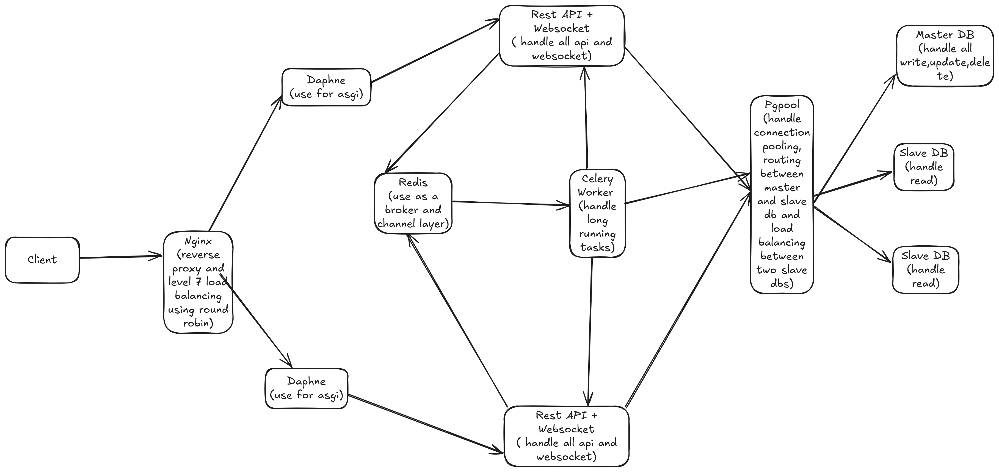

🧪 PostgreSQL Billion-Row Performance Benchmarking Suite

## 🚀 Introduction

This project is a comprehensive benchmarking suite designed to evaluate PostgreSQL query performance at scale—leveraging partitioning, indexing, and replication across billions of rows. The architecture simulates real-world workloads with a mix of high-volume inserts, intelligent query routing, and WebSocket-driven task notifications. Microservices are orchestrated using Docker Compose, enabling reproducible tests across a variety of configurations.

The system simulates real-world workload pressures using asynchronous ingestion, intelligent query routing, real-time notifications, and automated load testing—all containerized for reproducibility. It showcases critical performance techniques like **streaming replication**, **read/write splitting**, **index tuning**, and **query plan analysis**.

---

## ⚙️ Key Technologies

- **PostgreSQL** – Master-slave streaming replication with partitioned and indexed datasets
- **Pgpool-II** – Connection pooling, read/write routing, replica load balancing
- **PgBouncer** – Lightweight connection pooling to reduce backend stress
- **Celery** – Asynchronous task execution for large-scale data ingestion
- **Django + DRF** – RESTful APIs for data access and control
- **Django Channels + Daphne** – WebSocket support for real-time task status notifications
- **Nginx** – L7 reverse proxy with round-robin load balancing and WebSocket support
- **Locust** – Scalable load testing framework integrated as a container
- **Docker Compose** – Microservice orchestration for various infrastructure configurations

---

## 🧱 System Design (Full Stack)

The `docker-compose.with_nginx_pgpool_websockets.yml` setup represents the full-stack environment with the following services:

- **Nginx** – Public entry point for REST and WebSocket traffic, load balances requests across app containers
- **Django + Daphne** – Handles REST APIs and WebSocket communication over ASGI
- **Celery + Redis** – Manages background processing of large insert jobs and scheduled tasks
- **Pgpool-II** – Routes writes to the PostgreSQL master and balances reads between replicas
- **PostgreSQL (master + 2 replicas)** – Maintains replicated, partitioned datasets
- **WebSocket Clients** – Listen on `/ws/tasks/` to receive real-time updates on job status

> 📌 

---

## 🧰 Setup & Usage

### 📦 1. Clone the Repository

```bash
git clone https://github.com/RabbiHasanR/billion-row-api-benchmark.git
cd billion-row-api-benchmark
```

### ⚙️ 2. Create the `.env` File

```env
POSTGRES_USER=<>
POSTGRES_PASSWORD=<>
POSTGRES_DB=<>

DB_TEST_USER=<>
DB_TEST_PASSWORD=<>

# Replication user
REPLICATOR_USER=<>
REPLICATOR_PASSWORD=<>

PGPOOL_HEALTHCHECK_USER=<>
PGPOOL_HEALTHCHECK_PASSWORD=<>
```

### 🔐 3. Configure Pgpool Credentials

**Generate MD5 Password Hashes**

```bash
echo -n "your_passwordyour_username" | md5sum
```

**Update** `pgpool/config/pool_passwd`

```text
test_user:md5<hash>
replicator:md5<hash>
pgpool_healthcheck:md5<hash>
```

**Update** `pgpool/config/pcp.conf`

```text
admin:<admin_password_hash>
```

### 🐳 4. Launch the Stack

```bash
docker-compose -f docker-compose.with_nginx_pgpool_websockets.yml up --build
```

**Alternate setups for benchmarking:**

- `docker-compose.master_only.yml`
- `docker-compose.with_pgpool.yml`
- `docker-compose.with_pgbouncer.yml`
- `docker-compose.with_pgpool_and_pgbouncer.yml`

### 🏁 5. Trigger the Benchmark Workflow

- **Insert Data**: `POST /api/schema/insert-data/`
- **Monitor**: WebSocket at `/ws/tasks/`
- **Query Purchases**: `GET /api/performance/purchases/latest/`
- **Analyze Performance**: `GET /api/performance/purchases/latest/analyze/`
- **Run Load Test**: `POST /api/performance/load-test/`

---

## 📡 API Endpoints

### 🔸 `POST /api/schema/insert-data/`

Asynchronously populate billions of records using Celery workers.

**Request Body:**

```json
{
  "total_customers": 1000000,
  "total_products": 100000,
  "total_purchases": 5000000,
  "stage": "all"
}
```

**Stage options**: `all`, `customers`, `products`, `purchases`

**WebSocket notifications**: `/ws/tasks/`

### 🔸 `GET /api/performance/purchases/latest/`

Fetches recent purchases joined with customer and product data.

- Performs `JOIN` between `purchases`, `customers`, and `products`
- Read query is routed to replica via Pgpool-II

**Query Parameters:**

- `limit` (default: 100)
- `region` (optional)

### 🔸 `GET /api/performance/purchases/latest/analyze/`

Runs a stored function `analyze_latest_purchases(limit, region)` on the master DB to get `EXPLAIN ANALYZE` output.

**Query Parameters:**

- `limit` (default: 100)
- `region` (optional)

### 🔸 `POST /api/performance/load-test/`

Trigger a Locust test from the backend with flexible user and rate configs.

**Request Body:**

```json
{
  "users": 500,
  "spawn_rate": 50,
  "api_url": "http://127.0.0.1:5000"
}
```

**Returns:**

- Request stats
- Failure metrics
- Response timing summaries

### 🔸 WebSocket `/ws/tasks/`

Real-time task status updates (e.g., when background data insertion completes).

---

## 🧮 Database Schema & Initialization

Tables are automatically created when containers initialize using:

- `master_slave_replication/master/schema.sql`
- `master_slave_replication/master/raw_queries.sql`

### Core Tables

#### `customers`

```sql
CREATE TABLE IF NOT EXISTS customers (
    id BIGSERIAL PRIMARY KEY,
    name VARCHAR(255) NOT NULL,
    email VARCHAR(255) UNIQUE NOT NULL,
    country VARCHAR(100),
    created_at TIMESTAMP DEFAULT NOW()
);
```

#### `products`

```sql
CREATE TABLE IF NOT EXISTS products (
    id BIGSERIAL PRIMARY KEY,
    name VARCHAR(255) NOT NULL,
    category VARCHAR(100),
    price NUMERIC(10,2),
    created_at TIMESTAMP DEFAULT NOW()
);
```

#### `purchases`

```sql
CREATE TABLE IF NOT EXISTS purchases (
    id BIGSERIAL PRIMARY KEY,
    customer_id BIGINT REFERENCES customers(id),
    product_id BIGINT REFERENCES products(id),
    quantity INT NOT NULL,
    total_price NUMERIC(12,2),
    purchase_time TIMESTAMP DEFAULT NOW(),
    region VARCHAR(100),
    payment_mode VARCHAR(50),
    status VARCHAR(50)
);
```

Partitioning and indexing strategies are included in `schema.sql` for high-performance querying.

---

## 📊 Benchmark Results

The `/api/performance/purchases/latest/` endpoint was tested under various Docker Compose configurations using Locust to simulate concurrent GET requests. All tests were run on the following hardware:

- **Processor**: 12th Gen Intel® Core™ i5-1235U × 12
- **Memory**: 16.0 GiB RAM

### 🔸 Test Summary

| Docker Compose Variant            | Requests | Failures | Median Resp. (ms) | Avg Resp. (ms) | Max Resp. (ms) | Requests/sec |
|-----------------------------------|----------|----------|-------------------|----------------|----------------|--------------|
| with_pgbouncer                    | 19,804   | 0        | 390               | 722.22         | 53,958         | 334.70       |
| master_only                       | 22,302   | 16,836   | 230               | 465.48         | 31,485         | 376.80       |
| with_nginx_pgpool_websockets      | 6,413    | 0        | 7,700             | 6,215.93       | 10,632         | 108.64       |
| with_pgpool                       | 6,082    | 9        | 2,400             | 4,197.13       | 43,329         | 106.47       |
| with_pgpool_and_pgbouncer         | 1,004    | 0        | 31,000            | 26,928.88      | 56,595         | 17.73        |

### 🧠 Performance Insights

- ✅ **Fastest Read Performance**: `with_pgbouncer` delivered the best balance of low latency and high throughput with a median response time of **390 ms** and over **334 RPS**. PgBouncer’s lightweight transaction pooling was optimal for fast, high-volume reads.
- ⚡ **Highest Throughput (with caveats)**: `master_only` showed the highest raw requests per second (**376 RPS**) and minimal latency but also suffered significant request failures (**over 75% failure rate**). This indicates saturation and likely connection bottlenecks under heavy load without pooling.
- ⚙️ **Balanced Full-Stack Setup**: `with_nginx_pgpool_websockets` handled real-world components like reverse proxying and async updates well, achieving stable delivery and no failures, though with slightly higher response times due to additional networking layers.
- 🌀 **Pgpool-only Bottleneck: `with_pgpool` showed increased latency (**~4.2s avg**) and moderate errors, suggesting room for tuning connection limits or health check thresholds under Pgpool-II.
- 🧱 **Worst Performer**: `with_pgpool_and_pgbouncer` underperformed across all dimensions with very high latency (**~31s median**), indicating potential connection negotiation conflicts or over-pooling. This setup may benefit from role clarity between Pgpool-II and PgBouncer or pooled connection reuse mode optimization.

---

## 🧩 Challenges Faced

One of the most complex parts of this system was configuring **Pgpool-II MD5 authentication**, particularly setting up correct credentials for `pool_passwd` and `pcp.conf`. Mapping usernames to hashed passwords and syncing them across PostgreSQL, Pgpool, and PCP required deep understanding and precise configuration.

Additionally, **failover/fallback support** in Pgpool-II is a continuing challenge. While streaming replication and load-balanced reads work reliably, automatic node promotion and rebalancing on failure remain under exploration. Proper watchdog implementation and scripting are potential improvements in future iterations.

---

## 🤝 Contribution

Contributions are welcome! Whether it’s adding new test scenarios, tuning performance strategies, or improving documentation:

### How to Contribute

1. Fork this repository

2. Create a feature branch:

   ```bash
   git checkout -b feature/your-improvement
   ```

3. Commit your work

4. Open a pull request with a clear explanation

---